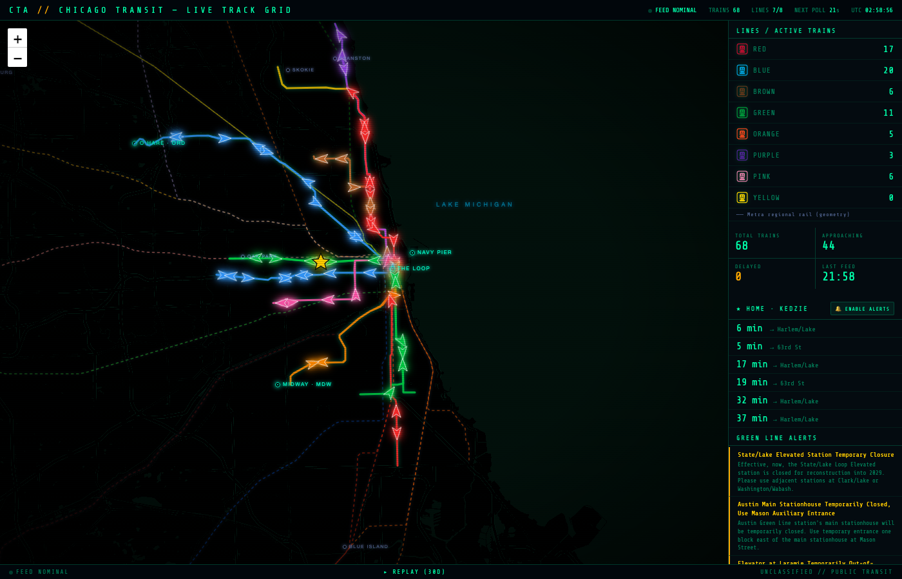

# CTA Track Grid

A realtime Chicago **'L' train monitor** styled as a NORAD / *WarGames* command board — live train positions, glowing route geometry, a 30-day history scrubber, and personal arrival/delay/disruption alerts. Runs entirely on **Cloudflare Workers** (edge proxy + Static Assets + D1 + cron).



**Live:** https://cta-track-grid.felipe-debene.workers.dev

---

## Features

- **Live map** — every 'L' train as a heading-rotated neon chevron, refreshed ~every 30s, colored per line, amber when delayed.
- **Glowing route geometry** — real CTA line paths drawn from GTFS, with dashed **Metra** regional rail beneath for context.
- **City + suburban landmarks** — the Loop, O'Hare, Midway, Navy Pier, plus Metra-reach suburbs (Evanston → Aurora → Joliet → Kenosha) for orientation.
- **Home station (Kedzie / Green Line)** — gold star, next-arrivals panel, and a **browser-notification alert engine**:
  - 🚆 train approaching Kedzie (≤6 min)
  - ⚠ Green Line delays
  - 📣 Green Line service disruptions (CTA Customer Alerts)
- **30-day replay** (`/replay`) — a per-minute history recorder writes to D1; scrub/playback the whole system over 1H–30D.
- **NORAD aesthetic** — near-black board, glowing vectors, CRT scanlines + vignette, `Share Tech Mono`.
- **Mobile-friendly** — responsive layout that stacks on phones.

---

## Architecture

```
Browser ──> Cloudflare Worker ──> CTA Train Tracker API   (key injected server-side)
            (src/index.js)    └─> CTA Customer Alerts API (keyless)
              │
              ├─ Static Assets (public/) — the monitor + replay UI
              ├─ D1 (cta_history)        — one snapshot row per minute
              └─ Cron triggers           — capture (* * * * *) + purge (0 4 * * *)
```

Why a Worker proxy: the CTA Train Tracker API has **no CORS headers**, so a browser can't call it directly. The Worker relays the request, injects the API key (kept as a secret), and edge-caches responses so a crowd of viewers collapses into one upstream call per window.

**History storage:** positions are stored as **one JSON blob per minute** (~1,440 writes/day) rather than one row per train (~259k/day) — keeping it comfortably inside the D1 free tier. A nightly cron purges snapshots older than 30 days.

### API endpoints

| Route | Description |
|---|---|
| `GET /api/positions?rt=red,blue,…` | Live train positions (proxied) |
| `GET /api/arrivals?mapid=41070&rt=g` | Arrivals at a station |
| `GET /api/follow?runnumber=910` | Follow one train run |
| `GET /api/alerts?route=G` | Service alerts for a line (keyless) |
| `GET /api/history/index?from=&to=` | Snapshot frame index (for replay) |
| `GET /api/history/snapshot?id=` | One historical snapshot payload |

---

## Setup

```bash
npm install

# Local secret — get a key at:
# https://www.transitchicago.com/developers/traintrackerapply/
cp .dev.vars.example .dev.vars     # then paste your key into .dev.vars

npm run dev                        # http://localhost:8787
```

Trigger the capture cron locally:
```bash
# wrangler dev must be started with --test-scheduled
curl "http://localhost:8787/__scheduled?cron=*+*+*+*+*"
```

## Deploy

```bash
npx wrangler d1 create cta_history                                      # once; paste id into wrangler.jsonc
npx wrangler d1 execute cta_history --remote --file migrations/0001_init.sql
npx wrangler secret put CTA_KEY                                         # paste your key
npx wrangler deploy
```

---

## Regenerating route geometry

The glowing lines are precomputed GeoJSON (no runtime GTFS parsing). Re-run when CTA/Metra update schedules:

```bash
# CTA  -> public/lines.geojson   (downloads CTA GTFS, extracts rail shapes)
node scripts/build_lines.mjs

# Metra -> public/metra.geojson  (downloads Metra static GTFS)
node scripts/build_metra.mjs
```
Both use greedy branch-coverage + point simplification to keep the files small (~50–65 KB).

---

## Project structure

```
src/index.js            Worker: API proxy, history endpoints, cron capture/purge
public/index.html       Live monitor (canonical frontend)
public/replay.html      30-day history scrubber
public/lines.geojson    CTA rail geometry
public/metra.geojson    Metra regional rail geometry
public/ctaData.js        302 stations (lat/lon + line flags)
public/images/          Per-line SVG badges
scripts/build_*.mjs     GTFS -> GeoJSON generators
migrations/             D1 schema
wrangler.jsonc          Worker config (D1 binding + cron triggers)
```

The top-level `server.js` / `monitor.html` / `script.js` are **legacy** — an earlier Node prototype kept for history. The canonical app is the Worker (`src/`) + `public/`.

---

## Roadmap

- **Analytics layer** — Green Line headways/bunching, on-time %, Kedzie wait-by-hour, speed heatmap (from the accruing history).
- **Realtime Metra trains** — decode the Metra GTFS-realtime protobuf feed (`gtfspublic.metrarr.com`, `api_token`) onto the dashed lines.
- **Email digest** — morning commute outlook via cron + Cloudflare Email.
- **Bus layer** — curated CTA Bus Tracker routes.

---

## Data sources & credits

- [CTA Train Tracker API](https://www.transitchicago.com/developers/traintracker/) — live positions/arrivals (requires a free key)
- [CTA Customer Alerts API](https://www.transitchicago.com/developers/alerts/) — service status (keyless)
- [CTA GTFS](https://www.transitchicago.com/developers/gtfs/) & [Metra GTFS](https://metra.com/metra-gtfs-api) — route geometry
- Map tiles © [OpenStreetMap](https://www.openstreetmap.org/copyright) contributors, via [CARTO](https://carto.com/) · rendered with [Leaflet](https://leafletjs.com/)

Not affiliated with the Chicago Transit Authority or Metra. For personal / educational use.
